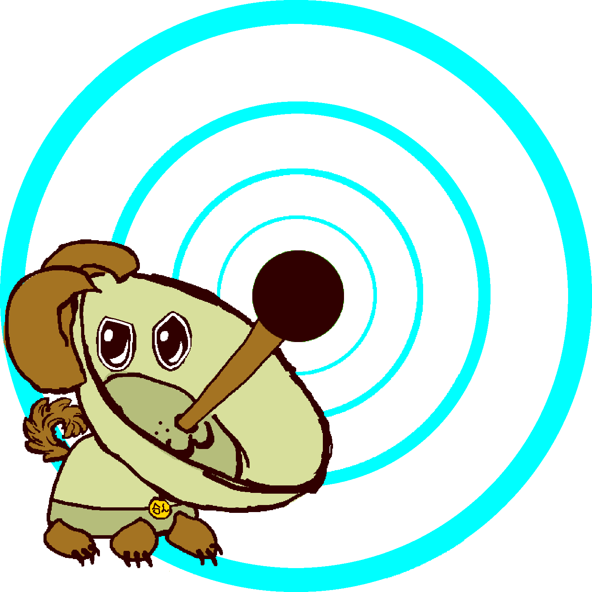
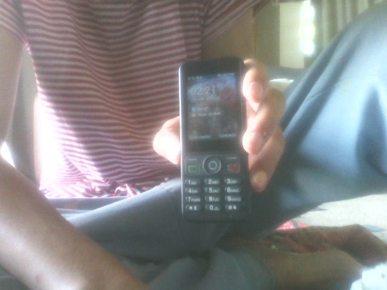

# submit-mc4d
The Submission template for Media Creation for Dogs Second issue (mc4d 001)

Truly you can submit whatever you want, 
but this is a form that will prompt you 
to submit to match the theme of MC4D's second issue, 001. 

For convenience, paste this into your email client of choice 
and begin inputting away to share some seeds for our digital art garden. 

direct all submissions to binnie@ravemail.com

Alternatively, [you can use Google Forms](https://docs.google.com/forms/d/e/1FAIpQLSesjcIVLQgq1_0UCSdU1hvrFG14KGw24emG8jfJqDyKLiPpsA/viewform)

## 1. Name you'd like to be credited under *

[ RESPONSE. ]

## 2. Any of your webpages

[ RESPONSE. ]

## 3. Ideal contact in case of followup

[ RESPONSE. ]

# Primary Contents
This will likely make up the bulk of your feature for MC4D 001

## 4. What mediums and tools have you felt at home working with? Why?

[ RESPONSE. ]

## 5. **Attach content you'd like to have shared on your MC4D 001 page**

(feel free to ask about alternative methods for sharing work)

## 6. What relevant software, hardware, techniques, processes, and inspiration led you to creating the works you've shared with us?

[ RESPONSE. ]

## 8. Are you open to follow up questions? *

Mark only one oval.

- [ ] Yes, send me the questions and I'll answer them.
- [ ] Yes, I'd like to be interviewed over text in realtime (*and I will reach out to you on when we can do this*)
- [ ] No

